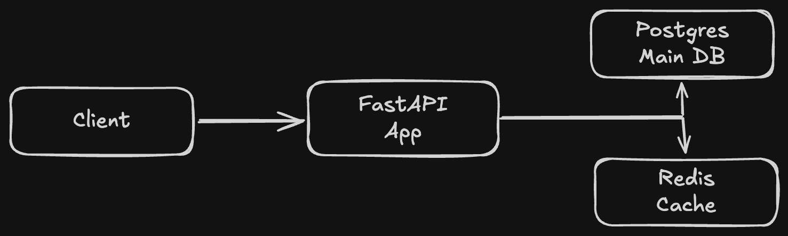

# Research Paper Management System

A production-grade backend system for managing and discovering
ML research papers — built as an evolving architecture to solve
real engineering problems at each phase.

## Architecture Overview

[embed your Excalidraw diagram image here]

## Architectural Evolution

### Phase 1 — Core API (v1-base-api)

**The problem:** Needed a secure, structured foundation for
managing research papers with proper access control.

**What was built:**

- REST API with FastAPI and PostgreSQL
- JWT authentication with refresh token rotation
- Role-based access control (user and admin roles)
- Redis-backed rate limiting per IP
- Dockerized environment — runs with one command

**Key decisions:**

- Raw SQL with asyncpg over an ORM — full query control
  and better performance visibility
- Separate access and refresh tokens — short-lived access
  tokens reduce exposure if compromised

---

## Current Architecture

## Running the System

### Prerequisites

- Docker and Docker Compose installed

### Start everything

\`\`\`bash
git clone https://github.com/yourusername/research-api
cd research-api
cp .env.example .env
docker compose up
\`\`\`

### Services

| Service  | URL                        |
| -------- | -------------------------- |
| API      | http://localhost:8000      |
| API Docs | http://localhost:8000/docs |

## Tech Stack

| Layer         | Technology          |
| ------------- | ------------------- |
| API           | FastAPI, Python     |
| Database      | PostgreSQL, asyncpg |
| Cache / Queue | Redis               |
