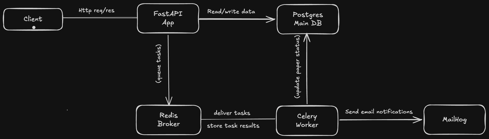
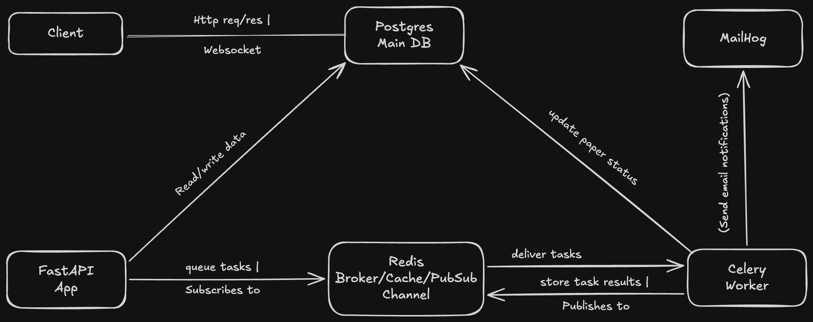

# Research Paper Management System

A production-grade backend system for managing and discovering
ML research papers — built as an evolving architecture to solve
real engineering problems at each phase.

## Architecture Overview

[Complete Architecture diagram here later(when i complete the whole imple)]
[Complete Architecture diagram here later(when i complete the whole imple)]

## Architectural Evolution

### Phase 1 — Core API (v1-base-api)

**The problem:** Needed a secure, structured foundation for
managing research papers with proper access control .

**What was built:**

- REST API with FastAPI and PostgreSQL
- JWT authentication with refresh token rotation
- Role-based access control (user and admin roles)
- Redis-backed rate limiting per IP
- Dockerized environment — runs with one command

**Key decisions:**

- Raw SQL with asyncpg over an ORM — full query control
  and better performance visibility
- Separate access and refresh tokens — short-lived access
  tokens reduce exposure if compromised

## Current Architecture

---

### Phase 2 — Async Processing (v2-async)

**The problem:** Fetching paper metadata from Arxiv synchronously
was blocking API responses and holding HTTP connections open while
waiting for external data. Bulk imports timed out completely.

**What was added:**

- Celery task queue with Redis as message broker
- Arxiv import endpoint — submits URL, queues background fetch
- Background paper metadata fetching from Arxiv API
- Exponential backoff retry on network failures
- Dead letter queue for exhausted retries
- Task status endpoint — clients poll for completion
- Email notification on import completion via SMTP
- MailHog for local email testing
- Task chaining — metadata task triggers email task on success
- Migration tracking system — schema_migrations table prevents
  duplicate migrations on container restart

**Key decisions:**

- Redis as broker and result backend — already in stack from
  Phase 1, reduces operational complexity over RabbitMQ
- psycopg2 for Celery DB access, asyncpg for FastAPI —
  Celery workers are synchronous, asyncpg requires async context
- Separate import endpoint POST /papers/import/arxiv — keeps
  manual creation and Arxiv import as distinct flows, making
  future import sources (DOI, Semantic Scholar) easy to add
- Polling for task status now — to be replaced by WebSocket
  push notifications in Phase 3

**Result:** API response time for paper submission dropped from
2-3 seconds synchronous wait to ~50ms. Client receives task_id
immediately and polls for completion.

## Current Architecture

---

### Phase 3 — Real-Time Notifications (v3-websockets)

**The problem:** Clients had to poll /tasks/{task_id} repeatedly
to know when paper processing completed. Inefficient and added
unnecessary API load.

**What was added:**

- WebSocket endpoint at /ws/{user_id}
- Redis Pub/Sub for broadcasting across server instances
- JWT authentication over WebSocket via query parameter
- Celery worker publishes completion events to Redis
- Client receives instant push notification on completion

**Result:** Eliminated polling entirely. Clients receive
notifications within milliseconds of task completion.

## Current Architecture

---

## Running the System

### Prerequisites

- Docker and Docker Compose installed

### Start everything

git clone https://github.com/yourusername/research-api
cd research_paper_management_api
cd research_paper_management_api
cp .env.example .env
docker compose up

### Services

| Service       | URL                        |
| ------------- | -------------------------- |
| API           | http://localhost:8000      |
| API Docs      | http://localhost:8000/docs |
| Flower        | http://localhost:5555      |
| MailHog Inbox | http://localhost:8025      |

## Tech Stack

| Layer             | Technology          |
| ----------------- | ------------------- |
| API               | FastAPI, Python     |
| Database          | PostgreSQL, asyncpg |
| Cache / Queue     | Redis               |
| Background Tasks  | Celery              |
| Worker Monitoring | Flower              |
| Email (local)     | MailHog             |
| Containerization  | Docker Compose      |

## Key Engineering Decisions

- **No ORM** — raw SQL with asyncpg gives full query visibility
  and control. Complex queries stay clean without fighting an
  abstraction layer.
- **Redis dual role** — serves as both cache/rate limiter (Phase 1)
  and message broker/result backend (Phase 2). One less service
  to operate.
- **Extensible import architecture** — import sources live under
  /papers/import/{source}. Adding Semantic Scholar or DOI lookup
  never touches existing endpoints.
- **Migration tracking** — schema_migrations table ensures
  migrations run exactly once regardless of container restarts
  or volume resets.
  | Layer | Technology |
  | ----------------- | ------------------- |
  | API | FastAPI, Python |
  | Database | PostgreSQL, asyncpg |
  | Cache / Queue | Redis |
  | Background Tasks | Celery |
  | Worker Monitoring | Flower |
  | Email (local) | MailHog |
  | Containerization | Docker Compose |

## Key Engineering Decisions

- **No ORM** — raw SQL with asyncpg gives full query visibility
  and control. Complex queries stay clean without fighting an
  abstraction layer.
- **Redis dual role** — serves as both cache/rate limiter (Phase 1)
  and message broker/result backend (Phase 2). One less service
  to operate.
- **Extensible import architecture** — import sources live under
  /papers/import/{source}. Adding Semantic Scholar or DOI lookup
  never touches existing endpoints.
- **Migration tracking** — schema_migrations table ensures
  migrations run exactly once regardless of container restarts
  or volume resets.
